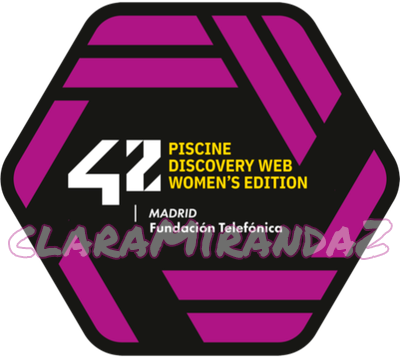

<h1 align=center>Piscine Discovery Web Women's Edition</h1>

 
<a href="https://eu.badgr.com/public/assertions/9MQIFk58Qc2-4dwVdr8dpQ" target="_blank">Verified by Badgr</a>

<h2>Acerca de este evento</h2>

Desde 42 Madrid se invitó a participar en una experiencia disruptiva presencial de cinco días llamada <b>Piscine Discovery</b>, en la que se podían adquirir una serie de conocimientos técnicos relacionados con el desarrollo web (HTML, CSS y Javascript), estimulando a la vez habilidades transversales y experimentando qué es 42 en primera persona y de forma 100% gratuita.

Con esta edición de su Piscine Discovery, 42 España daba un paso más en su apuesta por consolidar un sistema educativo y formativo que elimine estereotipos de género asociados a determinadas vocaciones y profesiones y que impulse el empoderamiento femenino en las disciplinas STEAM (ciencia, tecnología, ingenierías y matemáticas) desde estadios tempranos de la educación.

La falta de referentes femeninos en las carreras STEAM, unido al desconocimiento sobre las mismas, hace que la presencia de las mujeres en estas carreras sea mínima. Según datos del informe «<a href="https://www.educacionyfp.gob.es/dam/jcr:8d11c459-d25f-4113-a53b-5b97a91dd8cb/cifrasmefp2021.pdf" target="_blank">Igualdad en Cifras</a>» elaborado en 2021 por el Ministerio de Educación, el número de alumnas matriculadas de media en informática o algunas ingenierías no supera el 15%.

La filosofía de 42 en cuestión de género es dejar libertad a cada una de las academias que opten por el proceso que consideren más adecuado. Desde París, donde se creó el primer campus, el único cupo que permiten es el de género y se reservan plazas de las piscinas (las últimas pruebas de acceso a la formación) para mujeres, para maximizar la incorporación de estas a la academia. Los campus de 42 en España reservan un 30% de plazas para ellas en sus piscinas. Además, organizan diversas actividades para dar voz a referentes tanto del campus como de profesionales destacadas.

Un campus presencial sin clases, sin profesores ni libros, sin límite de edad, gratuito y abierto las 24 horas del día, los 365 días del año, para que los estudiantes puedan trabajar y aprender a su ritmo. <b>Eso es <a href="https://42.fr/" target="_blank">42</a></b>. Un concepto innovador y disruptivo, que llegó a España en septiembre de 2019 de la mano de <a href="https://www.fundaciontelefonica.com/" target="_blank">Fundación Telefónica</a>. Está abierto para todas las personas mayores de 18 años que aspiran a convertirse en profesionales de alto nivel. Y no se necesita titulación ni formación previa. Solo ser perseverante y tener ganas de “aprender a aprender”. 

 

¿Te lanzas a la Piscine Discovery?

 

> https://www.42madrid.com/actualidad/una-oportunidad-para-ellas-abrimos-piscine-discovery/

> https://www.fundaciontelefonica.com/noticias/los-campus-42-se-mueven-por-la-inclusion-laboral-de-la-mujer-en-entornos-tecnologicos/

> https://www.linkedin.com/feed/update/urn:li:activity:6945763696426020864/
